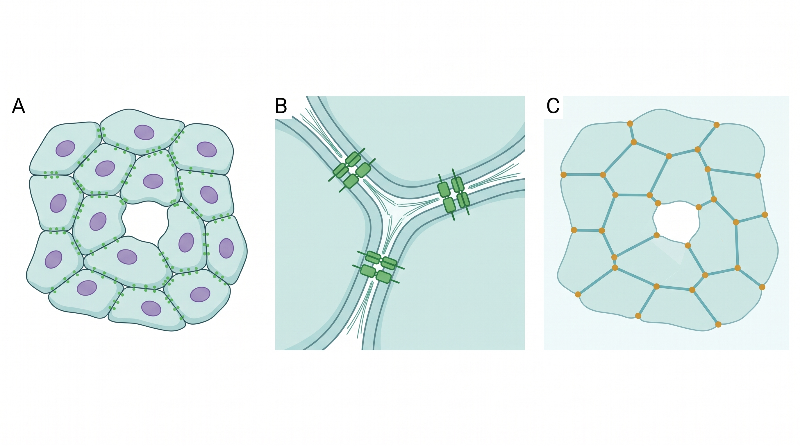
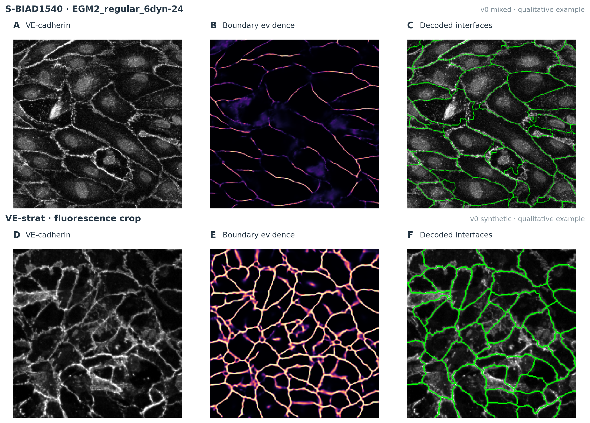
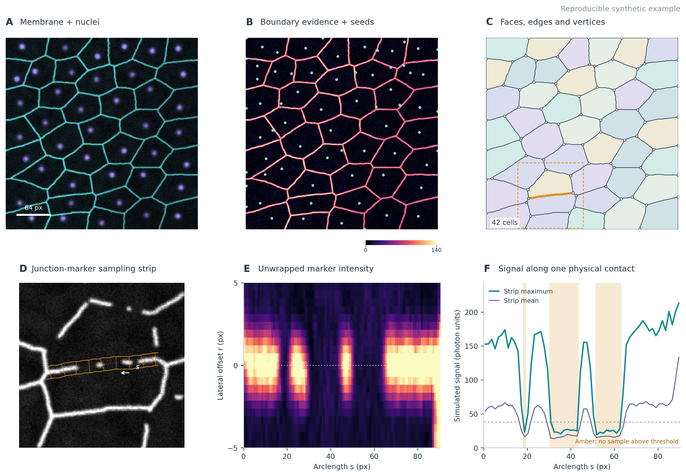
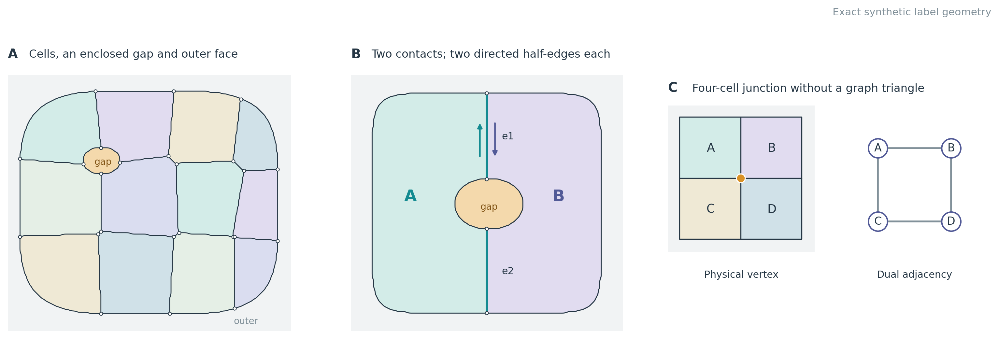
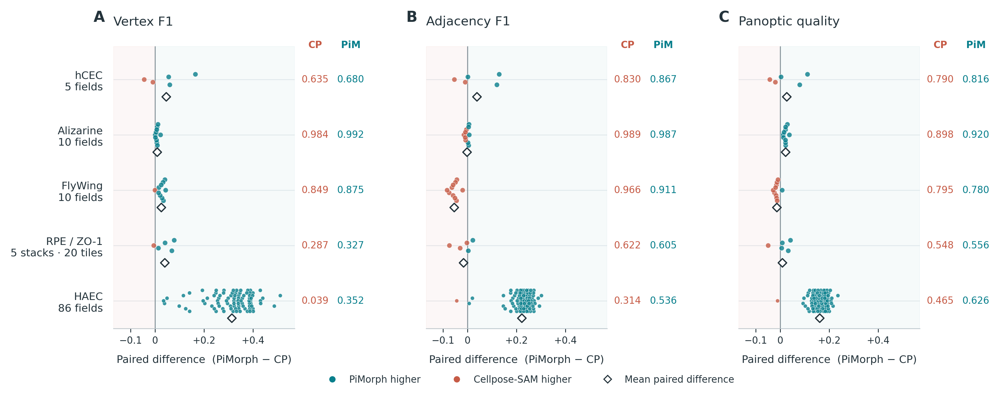
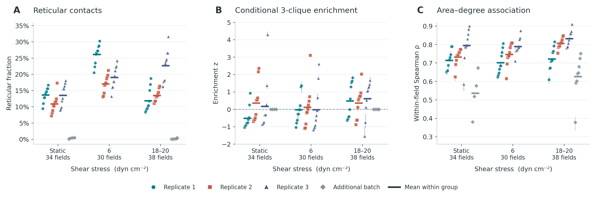
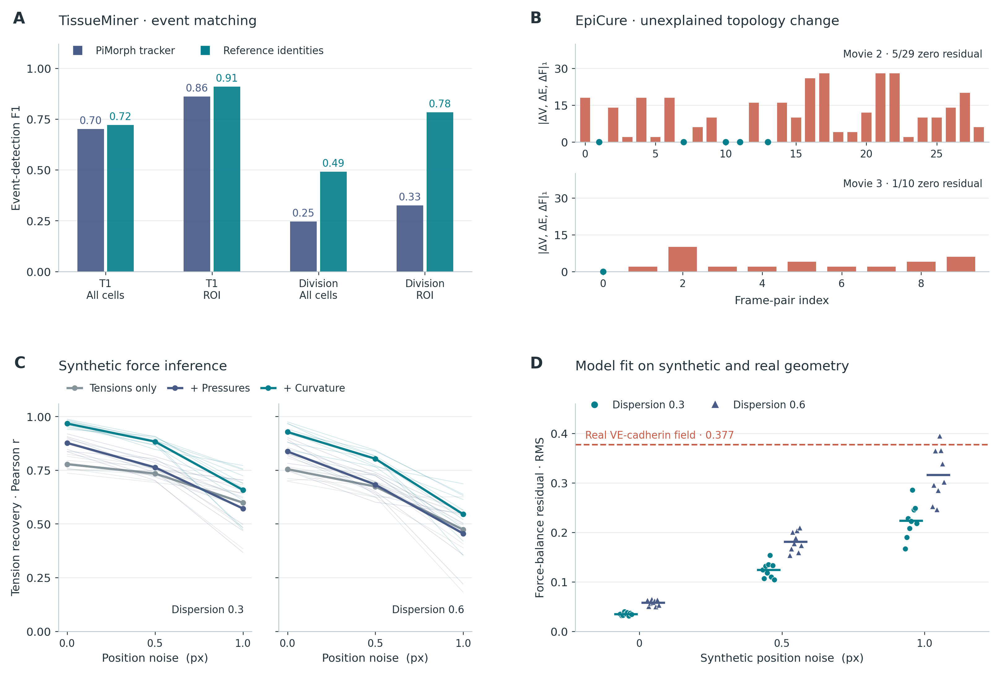

# PiMorph: reconstructing cell interfaces and measuring junction organization

PiMorph turns microscopy into an embedded cell complex: cells and extracellular gaps occupy faces, each connected contact has its own interface, and multicellular vertices retain the identities and cyclic order of the cells that meet there. Molecular measurements are attached to those physical interfaces. This provides a common representation for segmentation evaluation, junction profiles, contact networks and changes through time.

The study has two experimentally distinct parts. Annotated image datasets test whether reconstructed cells, contacts and vertices agree with reference masks. Endothelial fluorescence datasets then test what junction and network measurements can be extracted from real experiments, often without instance annotations. These are different forms of evidence. A valid complex is an exact representation of a segmentation; it does not establish that the segmentation or its biological interpretation is correct.

The current proposal checkpoint, **v6_pool**, improves mean adjacency F1, vertex F1, panoptic quality and boundary F1 over the recorded Cellpose-SAM baseline on the five held-out hCEC fields. Performance varies substantially with imaging modality: vertex F1 is 0.992 on the alizarine corneal test fields, 0.875 on FlyWing, 0.680 on hCEC, 0.352 on HAEC and 0.327 on RPE tiles. Cellpose-SAM retains advantages on several metrics and datasets. The current endothelial shear analysis supports an increase in the fraction of contacts assigned a heuristic reticular state at 6 dyn cm⁻²; earlier claims about independent clique enrichment and strengthened area–degree coupling do not survive the revised analysis.

[README.md](README.md) covers installation, commands and outputs. This document consolidates the methods, experiments, corrections and interpretation. Results below refer to archived runs; newly generated illustrations are identified separately from those experiments.

## 1. Biological question and image evidence

An endothelial sheet contains cells, cell–cell contacts and, sometimes, real extracellular gaps. The fluorescence along a contact may be continuous, intermittent, broad or reticular. These image patterns can be measured without assuming that a bright contact is mechanically stronger, that a gap conducts a known amount of solute, or that a morphology label identifies a validated biological state.

**Figure 1. Molecular context.** A, an endothelial sheet with purple nuclei, green boundary-associated marker signal, and an enclosed gap. B, a stylized adherens-junction close-up. C, cell faces, contact curves and multicellular vertices. All three panels are conceptual AI-assisted schematics, not measured or registered geometry. Created with BioRender.com; artwork terms are separate from the software license. The illustration distinguishes molecular organization from the structures visible at the image scale. PiMorph samples fluorescence along reconstructed interfaces; it does not resolve individual junction proteins or infer their molecular assembly from these images. Adhesion strength, barrier function and transport remain separate experimental questions.

The input contract distinguishes three roles. The **geometry channel** supplies evidence for cell boundaries; an independent membrane or cytoplasmic marker is preferable when junction abundance is the measurement of interest. The optional **nuclear channel** supplies seed evidence and helps resolve weak borders. The **junction channel** supplies the molecular signal measured along the reconstructed interfaces. Multiple channels can later be sampled at exactly the same coordinates.

This distinction matters on S-BIAD1540 and VE-strat, where VE-cadherin often supplies both geometry and junction signal. Boundaries selected using that signal are predisposed to lie on signal-rich regions. Boundary/interior enrichment and rendering likelihood are therefore self-consistency checks, not independent segmentation accuracy. Runs record `geometry_source: junction_channel`. The VE-strat source pairing was corrected to **w2 = VE-cadherin, w4 = nuclei**; the earlier zero-contact result came from a channel error and is not evidence that VE-strat lacks confluent cells.

**Figure 2. Real microscopy examples.** A–C show VE-cadherin in S-BIAD1540 field `EGM2_regular_6dyn-24` with the early v0 mixed-domain proposer; D–F show the archived VE-strat crop with the early v0 synthetic proposer. Each row presents the same field as geometry fluorescence, neural boundary evidence and decoded interfaces. Green curves are the recorded segmentation overlays. These are unchanged image crops recomposed with external labels; neither source has instance truth for these fields, and they are not evidence for v6 accuracy. Pixel dimensions and intensities are inherited from the source renders, so no physical scale is inferred. Original source files, crop rectangles and SHA-256 hashes are in [figure provenance](docs/figure_data/methods_real_microscopy_provenance.json).

Physical calibration is also part of the input evidence. Coordinates are stored in pixels; physical lengths require a verified pixel size. OME or acquisition metadata should be checked against the source study: a TIFF print-resolution tag is not automatically a microscopy calibration. For S-BIAD1169, the analysis uses the burned-in 50 μm bar, approximately 0.132 μm per pixel, rather than the print-DPI tag. Missing or doubtful scale information should remain in pixel units.

## 2. From images to a cell complex

### Proposal evidence and decoding

PiMorph separates image interpretation from geometry. A proposer returns dense boundary, seed, tissue and gap evidence, with optional vertex and signed-distance maps. A constrained decoder turns these maps into an integer cell-label image, then extracts the embedded complex. A classical proposer and a learned proposer share this interface; an externally produced label image can enter directly at the extraction step.

The classical proposer combines Sato ridge responses with normalized image intensity, estimates seed positions from nuclear peaks or distance-to-boundary maxima, and supplies a permissive tissue mask. Gap evidence favors dark regions far from seed support. This works best when the geometry resembles the bright junction networks it was designed for; its phase-contrast failures are measured below.

The learned proposer is a multi-head UNet with GroupNorm and SiLU. The current base-48, depth-4 checkpoint contains 19,441,446 parameters. Its six input planes are normalized geometry, nuclei and junction intensity, followed by three constant presence indicators. Missing optional channels contain zeros and a zero presence flag. Robust normalization maps the first and 99.8th intensity percentiles to the working range; it does not preserve absolute fluorescence across fields.

| Output head | Training target or meaning |
|---|---|
| Boundary | Binary inner boundary pixels derived from instance labels |
| Signed distance | Distance to a crack, positive in cells and negative in background, scaled by 16 pixels |
| Seed | Gaussian peaks at nuclei or cell centroids |
| Vertex | Gaussian peaks at vertices incident to at least three cells |
| Gap | Enclosed background; open exterior is a separate stored target |
| Log scale | Heteroscedastic scale for distance regression |

Boundary, seed and vertex heads use weighted binary cross-entropy; gap loss uses focal weighting; distance regression uses a Laplace negative log-likelihood, $|e|\exp(-s)+s$, with a bounded log scale. A soft clDice term encourages connected boundary evidence. Later recipes increase weight near true vertices and around missed or spurious decoded vertices. Pixels outside an annotated region receive zero training weight. The scale head describes distance-regression residuals, not a calibrated probability that a cell or contact is correct. Implementation: [neural model and training](src/pimorph/infer/neural/), [target construction](src/pimorph/synth/targets.py).

At inference, overlapping tiles are combined using cosine blending and reflected image padding. Optional test-time augmentation averages the eight rotations/reflections of the square. Nuclear peaks can add seeds where the learned seed map is silent. These seed scores remain proposal scores, rather than calibrated cell-existence probabilities.

The decoder runs marker-controlled watershed on boundary evidence, optionally smoothed and combined with vertex evidence or distance to the nearest seed. The signed-distance head separately excludes pixels predicted outside every cell. This distinction repaired a major error in sub-confluent HAEC fields: an enclosed-gap detector alone cannot distinguish all of the open exterior from tissue. With `outside_px = 0`, negative signed-distance pixels are excluded from the flood mask. Small enclosed background components can be filled, and small cell regions can merge into an adjacent region. Optional nucleus-consistency merges remove selected false splits lacking nuclear support. These are inference heuristics; they restrict which reconstructions are proposed.

**Figure 3. PiMorph in action with known synthetic input.** A, independent membrane and nuclear channels. B, `ClassicalProposer` boundary evidence and seeds. C, the constrained decoder's 42 cell faces, interfaces and vertices. The amber interface is measured in D–F. D, independently rendered junction signal and oriented sampling strip. E, those samples unwrapped by arclength and signed lateral offset, positive toward the forward half-edge's left face; display saturates at 140 photon units. F, transverse mean/maximum signal and an illustrative fixed threshold of 38 photon units. Amber spans have no sample above threshold: the measured unoccupied fraction and longest occupied-run fraction are both 0.30. Marker loss along a retained contact is distinct from a gap face. All dimensions are pixels; these are synthetic demonstration measurements, not biological estimates or held-out results. Representation checks pass. [Arrays and parameters](docs/figure_data/methods_in_action_provenance.json) record tissue seed 47 and acquisition seed 82.

### Geometry, topology and what validation guarantees

Extraction starts with the cracks between four-neighbor pixels of different labels. Each four-connected component of a positive label becomes a cell face. Enclosed zero-valued components become gap faces. All background components touching the image border, together with a padding rim, belong to one outer face. A repeated label with disconnected components becomes several faces with the same original label identifier.

Crack corners where three or four branches meet become vertices. A closed contour without a branching point receives one flagged artificial degree-two vertex so that it can be represented as a loop edge. Artificial vertices are bookkeeping devices and are excluded from biological multicellular-vertex counts. Four-way contacts are retained; the representation does not force every vertex to be trivalent.

Every **connected interface component** is a separate edge. Thus two cells can have two spatially separated contacts, and a cell can border an explicit gap. Two oppositely oriented half-edges describe each edge. Their ordering retains the cyclic arrangement of faces around a vertex, information that a simple adjacency graph loses.

**Figure 4. Information retained by the embedded complex.** A, synthetic cell faces, enclosed gap and connected exterior; white circles mark extracted vertices. B, an enclosed gap separates two connected cells' contact into two physical edges, each with twin half-edges keeping its incident face on the left. A simple graph collapses both contacts to one pair. C, four cells share a degree-four physical vertex while their dual graph is a four-cycle with no triangle. Thus graph cliques neither locate nor enumerate all multicellular junctions. These are exact synthetic label arrays passed through the extractor, not microscopy observations. [Provenance](docs/figure_data/methods_topology_provenance.json) records validation, contact multiplicity and the degree-four assertion.

Let $B_1$ be the oriented vertex–edge boundary matrix and $B_2$ the edge–face boundary matrix. The principal algebraic check is

$$B_1B_2=0,$$

expressing that the boundary of a boundary vanishes. Each edge has exactly two opposing face incidences. Face loops and vertex links must agree with the rotation system. With the outer face included and $c$ connected components of the one-skeleton, the Euler residual is

$$V-E+F-(1+c)=0.$$

These identities validate the representation. They also hold for an incorrectly segmented image and cannot substitute for comparison to expert masks. The same extractor is applied to Cellpose-SAM masks, so structural validity is not evidence of a segmentation advantage over that baseline.

Further checks include the defect identity

$$\sum_{f\ne\mathrm{outer}}(6-n_f)=6\chi+2\sum_v(d_v-3)+E_{\partial},$$

where interior faces include both cells and gaps, $n_f$ counts all interface occurrences around a face, $\chi=V-E+F_{\mathrm{interior}}$, and $E_{\partial}$ counts outer-face edges. The charge $q_f=6-n_f$ uses those full cell-face side counts. A separate Weaire check, $\sum_n p_n n m_n=\langle n^2\rangle$, uses **cell–cell interface incidence counts only**, with multiplicity, excluding gap/exterior sides; $p_n$ is the cell fraction with this count and $m_n$ is the mean corresponding count of its incident neighbors. Its $n$ must not be substituted for the full side number in the defect identity. They are representation identities, not empirical laws of endothelial biology. Definitions and executable checks are in [incidence.py](src/pimorph/complex/incidence.py) and [invariants.py](src/pimorph/complex/invariants.py).

Raw crack traces have staircase length bias. Endpoint-fixed Laplacian smoothing changes geometry while retaining connectivity and vertex order. On specific synthetic fixtures, the diagonal-boundary length error falls from +41.4% to +0.05%, and a radius-60-pixel disk has +0.24% perimeter error after smoothing. These demonstrate removal of a discretization effect, not a universal error bound for microscopy. Pixel area and smoothed polygon area remain distinct outputs.

## 3. Molecular fields, morphology and reconstruction sensitivity

For interface $e$, arclength coordinate $s$, transverse displacement $r$ and image channel $c$, PiMorph samples

$$P_e(s,r,c)=I_c\!\left(\gamma_e(s)+r\,n_e(s)\right).$$

Here $\gamma_e$ is the smoothed interface and positive $r$ points toward the forward half-edge's left face. The default strip has seven transverse samples across a three-pixel half-width and one-pixel arclength bins. Thresholds can be supplied or obtained by Otsu thresholding pooled interface samples. The common sampling coordinates support channel comparisons without independently moving each marker's measurement region.

Single-channel occupancy is the fraction of transverse samples above threshold. Continuity measures the longest occupied run along the interface. Width, intensity and left/right summaries add spatial detail. Multi-channel coverage applies its own occupied-bin threshold, typically at least 30% of transverse samples, and uses arclength weights. Occupancy and coverage therefore have distinct definitions. Co-occupancy, Jaccard overlap, exclusive fractions and discrete marker-presence states describe where signals coincide.

Morphology labels such as reticular, straight and fingers are feature-derived heuristic states. Their biological validity has not been established against independent expert annotations. Modern profile adapters preserve familiar `AJ_*` names but change some measurements: occupied arclength substitutes for legacy skeleton length, and occupied runs substitute for connected-component counts in a two-dimensional band. Absolute percentages from the two labelers should not be compared as if the classifier were unchanged. Relevant implementations are [strip sampling](src/pimorph/fields/strip.py), [profiles](src/pimorph/fields/profile.py), [functionals](src/pimorph/fields/functionals.py) and [multi-channel fields](src/pimorph/fields/multichannel.py).

A single segmentation can hide ambiguity. PiMorph therefore generates a finite set of candidate reconstructions by varying seed thresholds, seed retention, boundary smoothing, seed-distance mixture and gap thresholds, then adding selected merge/split alternatives. Pixel-identical candidates are deduplicated. Each candidate is a valid complex and receives a soft energy:

$$E=\lambda_I E_{\mathrm{image}}+\lambda_C E_{\mathrm{curve}}+\lambda_S E_{\mathrm{seed}}+\lambda_V E_{\mathrm{vertex}}+\lambda_P E_{\mathrm{shape}}.$$

The image term evaluates a rendered reconstruction; the curve term combines boundary support and curvature. The seed term counts proposal seeds per cell, which need not all be nuclei. Vertex degree and cell shape are soft priors. Their weights can be reduced or zeroed for unusual tissue, but this does not remove the decoder's separate threshold and size heuristics.

The implementation calls the resulting weighted collection a posterior:

$$w_h=\frac{\exp(-E_h/T)}{\sum_j\exp(-E_j/T)},\qquad \operatorname{ESS}=\frac{1}{\sum_h w_h^2}.$$

By default, temperature $T$ is chosen to obtain an effective sample size of four, limited by the candidate count. Shared seed identifiers define cells across hypotheses. Contact probabilities sum the weights of candidates containing the relevant cell pair; downstream statistics are recomputed on each candidate before weighted means and quantiles are taken. Vertex position summaries report an RMS spread conditional on an incident-cell set. See [posterior.py](src/pimorph/infer/posterior.py) and [sensitivity.py](src/pimorph/metrics/sensitivity.py).

This is a **finite energy-weighted sensitivity analysis**. Its intervals are conditional on the candidate family, fixed proposer and chosen energy. They have not been shown to cover total reconstruction error at their nominal level. Narrow intervals do not exclude a shared segmentation bias, annotation uncertainty or biological sampling variation. Calibration metrics are implemented, but implementation alone does not establish calibration on these studies.

## 4. Datasets, reference construction and evaluation units

The benchmark suite deliberately contains both close endothelial matches and transfer challenges. Tissue identity, imaging modality and annotation type determine what each result can establish.

| Dataset | Image and reference evidence | Evaluation split and limitation |
|---|---|---|
| hCEC | Cultured human corneal endothelium; NCAM membrane signal and DAPI; manually traced closed borders plus ROI; 0.65 μm/pixel | 10 training and 5 test fields. The source's 15 annotation fields came from three cultures; culture-disjoint evaluation is not established |
| Alizarine | Porcine corneal endothelium in situ; alizarine-red borders, expert closed contours and ROI | 20 training and 10 test fields; annotated ROI averages only about 28% of the image |
| FlyWing | Membrane-labeled Drosophila epithelium in the DenoiSeg release; curated instance labels | 32/10 image split of the 42-image upstream test array; specimen/movie-disjoint provenance is not established |
| HAEC | Human aortic endothelial culture; cytoplasmic GFP plus Hoechst; four-class semantic annotation converted to instances | 348/86 field split; sub-confluent; adjacency is sensitive to semantic-border conversion |
| mCellSeg | DIC HUVEC and HEK-293T images with expert instances | 160/40 fields; only 10 test images are HUVEC; mixed-cell-line DIC result |
| RPE | NIH-NEI retinal pigment epithelium; border/actin signal plus nuclei; manual VIA polygons combined across z | 13 training stacks and 5 test stacks; test comprises four tiles per stack, not 20 independent specimens |
| LIVECell | Phase-contrast images of eight cell lines with COCO instance polygons | Recorded large benchmark uses 400 test images; v1_multi saw training-split tiles |
| NeurIPS CellSeg | Diverse brightfield, fluorescence, phase-contrast and DIC images with instances | v1_multi benchmark is in-sample because those annotated images also supplied training tiles |
| Synthetic | Rendered tissues with exact labels, vertices, gaps and molecular channels | Distinct generator seeds; measures within-generator performance, not real-domain transfer |
| Legacy cornea | Specular microscopy with semantic labels that do not close cell borders | Derived watershed instances are unreliable for instance, adjacency and vertex accuracy |

The [hCEC primary study](https://www.nature.com/articles/s41598-025-14367-4) describes the three-culture annotation collection and manual tracing. Field-disjoint splits prevent direct reuse of the same image but do not establish generalization to unseen donors, cultures, microscopes or laboratories. FlyWing's interleaved index split is likewise an internal image holdout. Repeated developmental comparisons have used these same test fields. The Zenodo archive also contains HAEC decoder probes on test IDs 0005, 0010, 0015 and 0020, and the earlier protocol-development record reports mixed train/test inspection. Final frontier settings were selected on training fields, but that does not make the evaluation an untouched confirmatory holdout. These are field-disjoint gradient-training splits within a retrospective development campaign; a locked external evaluation remains desirable. Exact membership is recorded in [endothelial splits](runs/endo/splits.json), [confluent splits](runs/vertex/splits_confluent.json) and [RPE stack splits](runs/vertex/splits_rpe.json).

Reference conversion is part of the protocol. For hCEC and alizarine, connected components inside closed skeletons are filled within the annotation ROI. Pixels outside the ROI are unknown, not negative training examples. For polygon-derived labels, small enclosed background seams are filled with the documented 12-pixel rule; Cellpose-SAM's filled baseline receives the same small-seam treatment. These rules alter topology and must accompany a reproduced score. ROI-restricted scoring clips predictions to annotated regions and handles small fragments. Larger unannotated areas are not scored as missed cells.

The HAEC reference required a substantive correction. Its earlier four-connected markers included one- to three-pixel specks from ragged semantic borders as cells. The revised conversion uses eight-connected markers, rejects markers below 30 pixels, and ensures four-connected output components. On one example the count changed from 939 to 522 cells. Concurrently, the decoder's signed-distance exclusion stopped flooding open exterior. The old HAEC tables and the first ROI-as-background confluent training run are superseded; their changes cannot be attributed solely to model learning.

### Metrics

Cell matching uses a maximum-IoU assignment, retaining matches at IoU ≥ 0.5. Structural metrics are then computed from both label images' extracted complexes. All methods share extraction, ROI handling and evaluation; **Cellpose-SAM has its own mask decoder**, whereas the classical and neural PiMorph proposers share PiMorph's constrained decoder.

| Metric | What it tests |
|---|---|
| Pair adjacency F1 | Whether matched cells share any contact; disconnected contacts between one pair are collapsed |
| Component adjacency F1 | Whether individual physical interface components match, requiring mutual trace overlap within tolerance |
| Vertex F1 | Mutual-nearest positions of vertices incident to at least three cells, within 3 pixels |
| Incident-set accuracy | Correct mapped incident-cell set, conditional on a spatially matched vertex |
| Cyclic-order accuracy | Correct cyclic order, allowing rotation but not reversal, conditional on matched vertices |
| PQ | Panoptic quality: matched-instance overlap and detection quality |
| Boundary F1 | Boundary agreement within 3 pixels |
| Validity | Internal complex consistency; not segmentation accuracy |

A high positional vertex F1 need not imply correct surrounding cell identities. Conversely, localization error is measured only among matched vertices and does not account for entirely missed junctions. The three-pixel tolerance is not the same physical distance across microscopes; for hCEC it is 1.95 μm. Means below average per-image scores rather than pooling all cells or vertices. Method failures are recorded and excluded by the benchmark summarizer, so valid-image and error counts belong with every new run. Definitions: [matching](src/pimorph/complex/matching.py), [structural metrics](src/pimorph/metrics/structural.py), [benchmark runner](src/pimorph/bench/run.py).

## 5. Proposal learning and current benchmark results

The model sequence starts with synthetic evidence, adds real instance annotations, then emphasizes confluent tissue and hard vertices. Each generation inherits its predecessors' data and biases. These are development comparisons, not independent controlled ablations with repeated training seeds.

| Stage | Main addition | What the recorded comparison established |
|---|---|---|
| v0_synth / v0_mixed | Synthetic tissues, followed by real pseudo-labels | Strong synthetic reconstruction; poor zero-shot phase-contrast transfer |
| v1_multi | LIVECell training data and NeurIPS CellSeg instances | LIVECell adjacency F1 rises to 0.230 but remains below Cellpose-SAM 0.617 |
| v2_endo / v3_endo | HAEC and mCellSeg; corrected HAEC targets and exterior handling | Useful endothelial fluorescence accuracy; weak DIC transfer |
| v4_confluent | hCEC, alizarine and FlyWing training fields; ROI-ignore loss | hCEC vertex F1 rises from 0.334 to 0.611, with mixed effects across other datasets |
| v5_vertex | Vertex-focused loss and mined decoded errors | Plain hCEC decode reaches 0.636; tuned inference reaches 0.667 |
| v6_pool | 208 RPE training tiles and 1,200 PECAM-1 HUVEC consensus pseudo-label tiles | Tuned hCEC reaches 0.680; strengths and remaining failures are shown below |

The PECAM-1 pseudo-labels came from 300 selected fields of a 495-field real HUVEC collection. Cellpose-SAM supplied primary masks and v4 supplied a second opinion; disputed regions were ignored. Agreement between segmenters is not expert truth, and no expert instance benchmark for these PECAM-1 fields was included. The RPE training tiles came only from the designated training stacks. Checkpoint details are in the [consolidated model cards](models/README.md).

Tuned v6 inference uses dihedral augmentation and vertex evidence in watershed elevation. The recorded hCEC and RPE recipes use vertex weight 0.6, nucleus-consistency merging and one-pixel boundary smoothing. HAEC uses vertex weight 0.6 without those additional merge/smoothing overrides. Alizarine and FlyWing use vertex weight 0.3. A bare checkpoint choice with default reconstruction settings is not this full recipe. Benchmark environment settings are documented in [README.md](README.md) and the model card.

### Current paired comparison

The source of record is [final_summary.csv](runs/frontier/final_summary.csv), backed by the per-image files in [runs/frontier](runs/frontier/) and [runs/vertex](runs/vertex/). Parentheses give Cellpose-SAM with small-seam filling; higher is better for all four columns.

| Test data | Evaluation units | Adjacency F1: v6 (Cellpose) | Vertex F1: v6 (Cellpose) | PQ: v6 (Cellpose) | Boundary F1: v6 (Cellpose) |
|---|---:|---:|---:|---:|---:|
| hCEC | 5 fields | 0.867 (0.830) | 0.680 (0.635) | 0.816 (0.790) | 0.916 (0.880) |
| Alizarine | 10 fields | 0.987 (0.989) | 0.992 (0.984) | 0.920 (0.898) | 0.999 (1.000) |
| FlyWing | 10 images | 0.911 (0.966) | 0.875 (0.849) | 0.780 (0.795) | 0.994 (0.996) |
| RPE | 20 tiles / 5 stacks | 0.605 (0.622) | 0.327 (0.287) | 0.556 (0.548) | 0.731 (0.686) |
| HAEC | 86 fields | 0.536 (0.314) | 0.352 (0.039) | 0.626 (0.465) | 0.858 (0.708) |

**Figure 5. Structural accuracy relative to Cellpose-SAM.** Each point is the tuned-v6 minus Cellpose-SAM difference on the same evaluation field; positive favors PiMorph. Open diamonds show mean paired differences, and CP/PiM columns give absolute mean scores. A, vertex F1; B, adjacency F1; C, PQ. RPE's four tiles per stack are averaged before plotting, leaving five display units. Other points are fields, not necessarily independent cultures, donors or movies. HCEC culture-disjoint and FlyWing movie-disjoint validation are not established; the evaluation is a retrospective development benchmark. All 131 original field/tile pairs match one-to-one. No dataset-pooled mean or biological confidence interval is shown. [Compact figure inputs](docs/figure_data/) retain original identifiers and scores.

On hCEC, v6 produces about 3,014 vertices per field versus 2,974 in the reference, with precision 0.678 and recall 0.683. This is close count agreement, not statistical calibration. Cellpose-SAM retains higher precision, 0.721, better incident-set accuracy, 0.910 versus 0.858, and better matched-vertex localization, approximately 1.17 versus 1.28 pixels. PiMorph improves the three main cell/contact/vertex scores on three of the five fields; vertex-F1 differences range from −0.044 to +0.165. The mean improvement therefore deserves a per-field view and a small-sample qualification.

The alizarine result shows that clean, closed borders support very accurate contact and vertex reconstruction across methods. PiMorph's v5 vertex F1 of 0.993 is fractionally higher than v6's 0.992; the pooled checkpoint is not the winner of every single comparison. On FlyWing, v6 has higher vertex F1 on nine of ten images, but Cellpose-SAM has higher adjacency F1 on all ten. These metrics assess different errors and should be reported together.

HAEC remains difficult despite large improvement over the baseline. V6 predicts approximately 151 vertices per field against 92 reference vertices; precision is 0.293 and recall 0.453. Corrected v3 predicted approximately 95, illustrating that higher recall and F1 can accompany worse count agreement. Reference sensitivity and sparse culture contribute to difficulty, but the current experiments do not establish a hard accuracy ceiling imposed by the data. RPE likewise remains weak on vertices and must be evaluated at the stack level when making inferential comparisons.

For mCellSeg, the latest recorded corrected comparison is still v3 rather than v6: vertex F1 0.014, adjacency F1 0.064 and PQ 0.134 versus Cellpose-SAM 0.117, 0.170 and 0.215 on 40 DIC fields. These results do not support broad modality-independent superiority. See [mCellSeg per-image results](runs/vertex/mcellseg_test_v3endo/mcellseg_per_image.csv).

### What refinement did and did not improve

The hCEC sequence separates some changes: v4 plain vertex F1 0.611, v4 tuned 0.645, v5 plain 0.636, v5 tuned 0.667 and v6 tuned 0.680. Nuclear information, vertex-focused training and inference settings each mattered in this development sequence. The first confluent fine-tune mistakenly treated unannotated ROI exterior as background, reducing alizarine performance; ignoring those pixels repaired the training target. This is a general annotation-handling lesson rather than evidence for adding more model capacity.

Posterior MAP selection did not materially improve the tuned result. V5 hCEC vertex F1 changed from 0.667 to 0.669, while recorded method runtime increased from about 14 to 200 seconds per field. These timings belong to the archived hardware and include different inference recipes; they are not portable speed guarantees. The ensemble's current value is inspection of alternatives and propagation of conditional sensitivity, not a demonstrated accuracy/cost advantage.

### Earlier broad benchmarks

The large v1 campaign evaluated 400 LIVECell test images, 400 NeurIPS CellSeg images and 400 synthetic validation tiles, with smaller classical-baseline subsets. On LIVECell, adjacency/vertex/PQ were 0.230/0.164/0.403 for v1, 0.617/0.341/0.639 for Cellpose-SAM and 0.021/0.073/0.072 for classical inference. NeurIPS v1 scores, 0.097/0.058/0.390, were weak even in-sample. Synthetic v1 scores, 0.861/0.693/0.868, substantially exceeded classical 0.368/0.438/0.483. These establish useful learned proposals within scope and a substantial domain-transfer gap; they are not v6 evaluations. Archived outputs are under [runs/scale](runs/scale/).

Earlier six-image laptop LIVECell tests, the synthetic 40-tile development suite and legacy cornea scores answer narrower or different questions. Cornea's semantic-derived instances cannot validate instance recovery, even when a legacy overlap score appears favorable. Synthetic labels provide exact topology, but generator-held-out accuracy is still within-generator evidence. The repository retains these source outputs for traceability while current conclusions use the corrected comparisons above.

## 6. Endothelial shear: which findings survive reconstruction changes?

The current biological analysis uses all 102 EGM2 fields: 34 static, 30 at 6 dyn cm⁻² and 38 at 18–20 dyn cm⁻². V3_endo was selected by label-free self-consistency for this re-test; this is a separate archived experiment from the later v6 accuracy benchmark. For each field, 24–32 distinct reconstruction hypotheses were generated, all with effective sample size four. Statistics were computed per hypothesis and reduced to weighted field means. The authoritative table is [per_field_posterior_stats.csv](runs/shear_retest/per_field_posterior_stats.csv); [summary.json](runs/shear_retest/summary.json) records the reported condition comparisons.

| Current quantity | Static | 6 dyn cm⁻² | 18–20 dyn cm⁻² | 6 dyn vs static, field-level MWU |
|---|---:|---:|---:|---:|
| Fraction of interfaces labeled reticular | 0.112 | 0.207 | 0.127 | 2.63 × 10⁻⁹ |
| Raw all-reticular graph 3-clique fraction | 0.002 | 0.011 | 0.007 | 2.96 × 10⁻⁷ |
| Conditional-null 3-clique enrichment z | 0.003 | 0.025 | 0.381 | 0.952 |
| Within-field area–degree Spearman correlation | 0.722 | 0.746 | 0.753 | 0.431 |
| Graph 3-cliques realized at a physical vertex | 0.945 | 0.966 | 0.938 | 0.000617 |

**Figure 6. Shear-associated junction morphology after reconstruction re-testing.** Each point is a field's weighted candidate mean; thin intervals show its 5th–95th weighted candidate percentiles. Colors/shapes distinguish the three regular replicate groups; gray retains the additional batch. Thick strokes show condition-by-replicate means. A, reticular-contact fraction; B, all-reticular 3-clique enrichment against a null fixing the number of reticular contact pairs; C, within-field area–degree Spearman correlation. Fields are nested in replicates. Intervals express sensitivity within 24–32 candidates with ESS four, not calibrated biological uncertainty. The code assigns z = 0 when null standard deviation is zero; additional-batch near-zero enrichment values must be read with that convention. Literal `rep 1`, `rep 2`, `rep 3` and `rep1` identifiers remain distinct. Source: [field-level table](runs/shear_retest/per_field_posterior_stats.csv).

The clearest surviving pattern is a **+0.095 absolute difference in heuristic reticular fraction at 6 dyn cm⁻²**. The direction is shared by the three regular biological replicate labels: static-to-6-dyn means are 0.136→0.261, 0.109→0.170 and 0.135→0.190. Absolute levels are substantially lower than the earlier band-based labeler's roughly 0.51 and 0.62. This is expected because modern strip-derived morphology changes the measurement definition; agreement in the condition contrast is more informative than agreement in absolute label frequency.

The inferential unit needs care. The reported Mann–Whitney tests treat fields as observations, but multiple fields belong to the same experimental replicate. They are not 102 independent biological replicates. Three regular replicate groups each contribute ten fields per condition. A separately formatted `rep1` batch contributes four additional static and eight high-shear fields with near-zero reticular fractions; it should not be merged silently with `rep 1`. The complete analysis includes these fields, and a balanced 30+30 static/6-dyn sensitivity subset retains the directional result. Batch structure and the small number of biological replicates limit population-level inference.

The raw increase in all-reticular triangles is not an independent localization finding. The conditional null permutes reticular flags among contact pairs within each reconstructed field while preserving their number. After comparing the observed triangle statistic to this null, the static and 6-dyn enrichment distributions are indistinguishable in the recorded test. More reticular contacts are sufficient to explain more all-reticular triangles here. Approximately 95% of graph triangles correspond to a shared multicellular vertex in these reconstructed fields, but this does not make the two concepts universally interchangeable.

The earlier strengthening of area–degree correlation does not replicate: the current difference is +0.024, with field-level p = 0.431. Excluding exterior pixels improves cell geometry particularly in sparse static fields and plausibly explains the disappearance of the previous contrast. Earlier raw clustering-coefficient claims were already confounded by contact density, and the pooled degree–occupancy association disappeared in field-level testing. These claims are withdrawn rather than retained alongside the revised results.

The high-shear reticular mean is closer to static, with p = 0.407 against static at the field level. Thus the measured label fraction is not a monotonic shear-dose response. Other high-shear contrasts remain exploratory given batch heterogeneity and multiple comparisons. The finite-ensemble intervals are narrow relative to the 6-dyn contrast, but establish only stability within the sampled reconstruction family. VE-cadherin supplies both geometry and morphology, and no permeability or adhesion assay validates a functional interpretation. The supported statement is about an image-derived state frequency under the observed conditions.

## 7. Temporal, mechanical and multi-marker extensions

These modules extend the same representation and have separate validation boundaries. Their presence in the package should not be confused with complete validation on endothelial biology.

### Tracking and event bookkeeping

The tracker uses IoU and Hungarian assignment, constructs persistent IDs and flags split/merge/division candidates. Event detection compares complex snapshots and lineage, including T1 neighbor exchanges, divisions, extrusion, contact birth/death, gap nucleation/closure, rupture and resealing. Local combinatorial rewrites have explicit preconditions and expected count changes:

| Rewrite | $(\Delta V,\Delta E,\Delta F)$ |
|---|---|
| T1 neighbor exchange | $(0,0,0)$ |
| Contact birth / death | $(1,1,0)$ / $(-1,-1,0)$ |
| Division | $(2,3,1)$ |
| Extrusion of an n-sided cell | $(1-n,-n,-1)$ |
| Gap nucleation / rupture | $(2,3,1)$ |
| Reseal | $(-2,-3,-1)$ |

The admissibility check compares summed event deltas with the observed frame-to-frame count change. A nonzero residual flags an incomplete description. A zero residual is necessary bookkeeping consistency, not proof that every event was correctly identified; errors can cancel. Entry/exit and partial annotation require separate treatment. The rewrite library validates combinatorics but does not guarantee intersection-free geometry after a move.

On the 71-frame TissueMiner fly-wing demo, **ROI-restricted** T1 detection using supplied identities gives precision 0.92, recall 0.90 and F1 0.91; PiMorph's IoU tracker gives 0.85/0.87/0.86. All 761 isolated T1s in the recorded charge test conserve charge. ROI-restricted divisions expose the tracker's weakness in rapidly moving tissue: supplied IDs give precision 0.64 and recall 1.00, whereas the tracker gives precision 0.19 and recall 0.96, with 685 ID switches across 1,313 tracks. The sparse CTC HeLa sequence gives division F1 approximately 0.93 with the tracker, but 18 ID switches across 37 tracks and frequent admissibility failures remain.

EpiCure demonstrations use curated track identities. Histoblast movie2 yields 59/59 isolated T1 charge checks but only 5/29 fully explained frame pairs. Zebrafish movie3 yields 13/13 charge checks and 1/10 fully explained pairs. Partial annotation and free boundaries explain prominent residuals; divisions remain heuristic because no lineage file was parsed. These are evidence for event bookkeeping and its diagnostics, not an endothelial time-lapse validation. Sources: [dynamics outputs](runs/dynamics/), [event rewrites](src/pimorph/complex/events.py), [tracking and detection](src/pimorph/dynamics/).

### Relative mechanics and noise sensitivity

The mechanics module implements a vertex model with area/perimeter elasticity and line tension, fixed boundary vertices and relaxation that rejects certain orientation changes. Force inference fits vertex balance, optionally adds curvature-based Laplace equations, regularizes underdetermined directions and reports rank, gauge and conditioning. Tensions and pressures are relative; absolute force scale is not identifiable from geometry alone.

Synthetic recovery uses sheets generated under the same model assumptions. At zero vertex noise and ridge 0.001, curvature-assisted recovery correlates approximately 1.00 with effective tension and pressure. Figure 7 instead fixes ridge 0.1 across noise levels; its zero-noise tension correlations are approximately 0.967 and 0.928 for the two dispersions. With 0.5-pixel vertex noise and ridge 0.1, tension/pressure Pearson correlations are approximately 0.88/0.94 for the lower tension dispersion and 0.80/0.86 for the higher dispersion. At one-pixel noise, the former falls to approximately 0.66/0.83. The recovered target is effective tension, including elastic contributions, not simply the sampled bare line-tension parameter.

**Figure 7. Dynamic and mechanical validation.** A, TissueMiner sequence-level event F1 with PiMorph tracking or supplied identities, both before and after restricting predictions to the database ROI; reference counts are 1,086 T1 events and 27 divisions. B, the L1 norm of unexplained changes in vertices, edges and faces between EpiCure frames. Green points mark exact zero residuals: 5/29 and 1/10 frame pairs. C, synthetic effective-tension recovery across position-noise levels and two prescribed tension dispersions, comparing tension-only, pressure-augmented and curvature-augmented models at the same ridge 0.1. Thin curves show nine valid geometry seeds; thick curves show means. D, corresponding curvature-model force-balance RMS residuals over seeds and dispersions, with the single real reconstruction's 0.377 residual as a dashed reference. Effective tension includes perimeter/core contributions. The real comparison is a fit diagnostic, with no independent force measurement. Events, frames and edges are not treated as biological replicates. Sources: [TissueMiner](runs/dynamics/tissueminer_demo/summary.json), [mechanics](runs/mechanics/synthetic_validation.csv) and [EpiCure outputs](runs/dynamics/).

These experiments verify solver recovery under a specified forward model. On the real VE-strat Control_s1 reconstruction, inferred relative tensions have force-balance residual RMS about 0.38, and only 2% of interior vertices balance within 5%. The balance model describes that geometry poorly. Those tables are diagnostics, not validated measurements of endothelial tension or pressure. No laser-ablation, traction or other force measurement supplies independent calibration. Evidence: [synthetic_validation.csv](runs/mechanics/synthetic_validation.csv), [real-field summary](runs/mechanics/ve_strat_Control_s1_summary.json), [mechanics source](src/pimorph/mechanics/).

### Three-dimensional complexes

The 3-D extractor represents cell volumes, separating interfaces, junction lines and vertices on a voxel crack construction. It checks $B_1B_2=0$ and $B_2B_3=0$ and compares coarse topology with the occupied voxel set. Closed components receive explicit bookkeeping conventions analogous to 2-D artificial vertices. A surface-monolayer adapter can retain three-dimensional coordinates around a lumen.

Synthetic tests cover cubes, enclosed cavities, toroidal handles, Voronoi volumes and random stress cases. Handles can challenge coarse Euler counting even when the boundary algebra is exact; exact per-cell surface Euler quantities should be requested when that distinction matters. No real 3-D microscopy volume with reference cell truth was evaluated in this campaign. This is tested representation infrastructure, not a demonstrated three-dimensional endothelial segmenter. See [complex3d](src/pimorph/complex3d/) and [tests](tests/pimorph/test_complex3d.py).

### Multiple junction markers and a transport proxy

The S-BIAD1169 demonstration samples VE-cadherin, claudin-5 and F-actin on shared interfaces in dermal microvascular endothelium. The final processed set contains 17 fields: three DMSO controls and 14 fields across BRAF-inhibitor treatments/doses, totaling 267 reconstructed cells and 546 cell–cell interfaces. Geometry comes from VE-cadherin, with nuclear seeds; loss of that marker can therefore bias which contacts survive reconstruction.

| Arclength-weighted field measurement | DMSO mean | BRAFi mean | Recorded MWU p |
|---|---:|---:|---:|
| VE-cadherin coverage | 0.414 | 0.394 | 0.676 |
| Claudin-5 coverage | 0.376 | 0.358 | 1.000 |
| AJ/TJ co-occupancy | 0.248 | 0.235 | 0.676 |
| AJ/TJ Jaccard | 0.376 | 0.389 | 0.859 |

A pooled GMM selects four states by BIC, with bootstrap adjusted Rand index 0.544 ± 0.114. These are descriptive joint image states with moderate stability. One marker-state comparison has unadjusted p = 0.021 among 21 tests, with only three controls; it is not a robust treatment finding. Images are eight-bit display exports with independently scaled intensities, so between-field absolute intensity is not comparable. Source measurements are [per_field.csv](runs/multijunction/per_field.csv), [per_edge.csv](runs/multijunction/per_edge.csv) and [joint-state metadata](runs/multijunction/joint_states_meta.json).

Transport is a hypothesis layered onto these measurements. A hand-set interface conductance increases with uncovered marker length, schematically

$$g_e=g_0+L_e\sum_c a_c(1-\mathrm{coverage}_{e,c}).$$

The through-plane proxy sums paths; the in-plane proxy solves a graph-Laplacian Dirichlet problem between designated cell/gap nodes. The latter has adjoint edge sensitivities proportional to squared potential differences. Finite-difference and Rayleigh-monotonicity tests verify the resistor calculation, not the biological mapping. Cell-node conductances are a chosen model and do not constitute an anatomical reconstruction of all paracellular transport routes. No TEER or tracer-flux measurements validate the weights or predicted permeability; barrier reports explicitly carry `validated: false`.

## 8. Historical feature validation and robustness

The legacy EndoPiGraph work established the initial feature extraction, polarity analysis and condition classifiers. Its outputs remain useful provenance, but several earlier headline statements require narrower interpretation.

**Adjacency extraction from supplied masks.** The original LIVECell and NuInsSeg comparisons fed annotated masks into the adjacency algorithm; they did not test raw-image segmentation. LIVECell used a reference contact threshold of at least five boundary pixels, NuInsSeg at least three. The final legacy cornea comparison first derived watershed instances from semantic labels, then compared extracted contacts with a semantic-border reference.

| Historical mask-based test | Images | Precision | Recall | Reported F1 | Scope |
|---|---:|---:|---:|---:|---|
| LIVECell | 50 | 0.980 | 0.674 | 0.784 | Contact extraction on supplied cell masks; per-image means |
| NuInsSeg | 80 | 0.938 | 0.749 | 0.822 | Contacts between supplied nuclei masks, not cell junctions; per-image means |
| Cornea, final legacy protocol | 160 | 0.997 | 0.874 | 0.931 | Pooled agreement against a derived semantic-border contact reference |

These numbers come from [LIVECell results](runs/livecell_validation/adjacency_validation_results.json), [NuInsSeg results](runs/nuinsseg_validation/adjacency_validation_results.json) and [the final cornea benchmark](runs/cornea_validation_v2/cornea_final_benchmark.json). The latter records 10.43 seconds for adjacency extraction across 160 already-derived label images, excluding image loading and instance construction; it is not end-to-end inference time. Its direct-mask reference gives F1 = 1.0 because it applies essentially the same contact rule to the same derived masks. Neither that self-agreement nor the semantic-border F1 validates actual cell instances. The cornea instance-reference problem described in Section 4 supersedes the earlier “ground-truth instance” characterization. Legacy comparator settings also differ materially—for example, the dilation implementation caps consideration at 200 labels—so these timings and scores do not establish a general superiority claim.

**Heuristic-label prediction.** The random-forest morphology model reached accuracy 0.9960 and macro-F1 0.9908 on 3,520 contacts from 15 images using image-grouped cross-validation. The targets were threshold rules on the same feature family. This demonstrates rule approximation across held-out images, not biological-class accuracy. The 0.97–1.00 cross-dataset agreement numbers similarly compare against heuristic labels. Expert-labeled junctions, inter-rater agreement and independent-image evaluation are still needed. The original evaluation is [ajmorph_evaluation_report.json](models/ajmorph_evaluation_report.json).

**Condition prediction.** The archived EGM2 typed/untyped experiment contains **62 fields: 32 static and 30 at 6 dyn**, rather than all 102 fields or three conditions. Logistic-regression macro-F1 is 0.9188 with 18 typed features and 0.8063 with seven untyped features; the random-forest scores are approximately equal at 0.870. However, [the script](scripts/typed_vs_untyped_experiment.py) fits its standardizer on the complete feature matrix before leave-one-image-out prediction. This leaks held-out feature-distribution information into preprocessing. Feature exploration and shared experimental batches add further limitations. These archived scores are exploratory and do not support a clean out-of-sample superiority claim. A new assessment should fit preprocessing within each training fold and hold out experimental groups. Sources: [feature matrix](runs/egm2_full/image_features_for_classification.csv), [prediction results](runs/egm2_full/typed_vs_untyped_results.json).

The earlier small 15/18-image comparisons changed direction depending on feature count and classifier. Selecting a single strong feature after inspecting the same data cannot establish its independently validated advantage. Separate edge-level condition-prediction reports around 78–81% accuracy also concern experimental labels within the sampled study, not validated morphology classes or transfer to a new laboratory.

**Polarity.** The preliminary 15-field analysis gave mean resultant lengths near 0.13, 0.21 and 0.23 for static, intermediate and high shear. For cell angles $\theta_i$, $R=|N^{-1}\sum_i e^{i\theta_i}|$ measures directional concentration. Signed projection onto a flow cue additionally requires an independently verified cue angle. Inferring that angle from the same cell orientations is exploratory; the sign cannot be interpreted as upstream/downstream polarity without acquisition metadata. These are Golgi–nucleus orientation measurements, not the same measurement as cell long-axis alignment.

**Robustness.** The legacy perturbation study sampled five S-BIAD1540 images and tested thresholds, strip dilation, ±20% intensity scaling, Gaussian noise and one-/two-pixel blur. Twenty-eight of thirty selected parameter–metric comparisons had $|d|<0.5$ in that experiment. Cluster counts were particularly blur-sensitive; thickness and skeleton-derived measures can also change strongly. Adaptive thresholding made selected occupancy-like measures stable under the tested scaling, but neither occupancy nor mean intensity is universally invariant to blur, clipping or threshold changes.

The blur-robust classifier preserved 93.3% of labels versus 89.1% for the original rules on its test perturbations. These are label-consistency scores, not accuracy, and a nearly constant classifier can be highly stable. The reported “Junction Mapper equivalent” is a local proxy; it is not a controlled head-to-head run of the native Junction Mapper tool. Earlier capability-count tables are feature inventories, not comparative scientific performance evidence. Unsharp masking can alter appearance but cannot recover missing optical information. Source data are under [cross-dataset validation](runs/cross_dataset_validation/) and [blur robustness](runs/blur_robust_improvement/).

## 9. Reproducibility, provenance and remaining experiments

Software tests exercise extraction identities, holes and islands, multiple contacts, event round trips, metric behavior, synthetic training, mechanics, transport and three-dimensional algebra. The documentation audit executed the current available suite with **322 passed and three skipped**; the skips cover the neural test module because torch is unavailable in that audit environment and two VE-strat tests lacking the paired manifest. No GPU inference or checkpoint benchmark was rerun. A historical scale campaign reported 259 passed and two skips on its earlier revision. Software correctness tests and scientific accuracy benchmarks have distinct purposes. Re-running the relevant tests is necessary after implementation changes, while scientific claims require the corresponding source images, annotations and experiment protocol.

A reproduction should record the checkpoint, training source/split, decoder settings, channel mapping, physical calibration, reference conversion, tolerance, failed-image count and hardware for runtime comparisons. Training uses `python -m pimorph.infer.neural.train`, with resolved configuration and per-epoch logs beside the checkpoint. Automatic field-grouped splitting works when source-field metadata is available; explicit train/validation directories require the caller to preserve the intended separation. The default neural reconstruction and the tuned benchmark recipe should not be conflated.

The highest-value next experiment is independent annotation of real junction-stained endothelial monolayers, with culture/donor-level holdouts and repeated annotators. The current PECAM-1 collection is an available source but supplies pseudo-labels rather than reference truth. Further tests should quantify annotation sensitivity, evaluate contact-probability calibration, improve motion-aware tracking, and connect molecular image states to independently measured barrier or mechanical function. A finite dataset search cannot establish that no suitable dataset exists anywhere; the present study simply did not include a public junction-stained endothelial instance benchmark that closes all of these gaps.

### Data and model availability

The proposal/data archive is [Zenodo record 22839867, version 1.1.0](https://zenodo.org/records/22839867), under [concept DOI 10.5281/zenodo.22839866](https://doi.org/10.5281/zenodo.22839866). Its files separate proposal checkpoints, benchmark/development outputs and training tiles. The results and model archives were downloaded and MD5-verified for this documentation audit, and all 1,108 CSV/JSON files shared between the results archive and repository matched byte-for-byte. The training-archive checksum below is record metadata; that archive was not downloaded in this audit. The older [software release, Zenodo 19831621](https://zenodo.org/records/19831621), is version 1.0.0 and is distinct from the version-1.1.0 proposal/data record; a software citation and a dataset citation identify different artifacts.

| Archive | Bytes | MD5 from the record |
|---|---:|---|
| `pimorph_results.tar` | 996,526,080 | `439a6d62c5b2c38a9431c3771048be08` |
| `pimorph_models.tar` | 536,368,128 | `bebb467a5d85d47cf345a6252d7fb8dc` |
| `pimorph_training_tiles.tar` | 1,583,948,800 | `b6b113628da00f60986f2d36ad56884d` |

The [source audit manifest](docs/figure_data/zenodo_provenance.json) records checksums and metadata for the PiMorph archives and 18 linked Zenodo sources, distinguishing downloads from metadata-only inspection.

The results archive contains tables, reports and rendered QC images, not original TIFF/NPY/NPZ reference acquisitions. Original third-party data must be obtained from their own sources. [fetch_zenodo.py](scripts/fetch_zenodo.py) retrieves record files and verifies checksums; preserve a versioned record ID when freezing a publication reproduction rather than relying solely on a moving concept DOI.

| Source | Role in this study |
|---|---|
| [HAEC, Zenodo 4898011](https://zenodo.org/records/4898011) | Cytoplasmic/nuclear endothelial images and semantic annotations |
| [mCellSeg, Zenodo 20174259](https://zenodo.org/records/20174259) | Expert DIC instance reference dataset |
| [hCEC primary paper and supplementary data](https://www.nature.com/articles/s41598-025-14367-4) | Manually traced NCAM/DAPI cultures |
| [Alizarine mirror](https://github.com/adriankucharski/gan-synthetic-corneal-endothelium/tree/main/extra_data/Alizarine) | Expert corneal contours and annotation ROI |
| [FlyWing, Zenodo 5156991](https://zenodo.org/records/5156991) | DenoiSeg membrane-image release and instance labels |
| [NIH-NEI RPE data, Figshare+ 28832501](https://plus.figshare.com/articles/dataset/RpeMapTrainingData/28832501) | Annotated confocal stacks |
| [PECAM-1 HUVEC, Zenodo 10611092](https://zenodo.org/records/10611092) | Real junction-stained pseudo-label source |
| [VE-strat, Zenodo 13936923](https://zenodo.org/records/13936923) | Junction/nuclear fields and morphology patches |
| [S-BIAD1540](https://www.ebi.ac.uk/biostudies/bioimages/studies/S-BIAD1540) | Shear-stress endothelial fluorescence study |
| [S-BIAD1169](https://www.ebi.ac.uk/biostudies/bioimages/studies/S-BIAD1169) | Multi-marker endothelial demonstration |
| [EpiCure, Zenodo 20607705](https://zenodo.org/records/20607705) | Curated epithelial movies |
| [NeurIPS CellSeg, Zenodo 10719375](https://zenodo.org/records/10719375) | Broad real-instance training/benchmark source |
| [Lymphatic junction data, Zenodo 13880404](https://zenodo.org/records/13880404) | Historical cross-dataset feature exploration |

Dataset and checkpoint rights are separate from the software license. The hCEC source is recorded as CC BY-NC-ND 4.0 and alizarine as noncommercial research with citation; hCEC data entered the v4/v6 training lineage. The checkpoint cards accordingly describe research evaluation use. RPE is recorded as CC0. Fresh Zenodo metadata lists the PECAM-1 source under MIT, correcting the older checkpoint card's CC BY 4.0 attribution; the NeurIPS CellSeg source, also in the model lineage, is CC BY-NC-ND 4.0. This inventory does not establish unrestricted reuse or redistribution of every derived asset; consult the source-specific terms and permissions for the intended use.

### Implementation conventions for downstream users

| Convention | Definition |
|---|---|
| Coordinates | `(row, col)`; pixel centers are integers, crack corners are half-integers |
| Rotation | Angles computed in `(x=col, y=-row)` so counter-clockwise order is visually consistent |
| Forward/twin half-edge | `2*e` and `2*e+1`; twin is `h ^ 1`; each stores its left face |
| Face order | Cells, then enclosed gaps, then exactly one outer face |
| Contact multiplicity | One edge per connected interface; simple-graph degree may differ from face side count |
| Artificial vertex | Flagged degree-two insertion on a closed unbranched contour; not a multicellular junction |
| Geometry | Exact crack polyline retained separately from optional smoothed geometry |
| Units | Pixel storage; micrometer interpretation only with verified calibration |
| Event geometry | Rewrites check topology; smoothing and geometric inspection may still be needed |
| Exported measurements | Canonical cells/interfaces/vertices/gaps plus legacy adapters; shared column names need not imply identical legacy definitions |

The figures can be regenerated with [figures_methods.py](scripts/figures_methods.py) and [figures_results.py](scripts/figures_results.py). The results script uses compact committed inputs by default; `--refresh-data` rebuilds them from archived run outputs and records source hashes. [PNG, editable SVG and PDF assets](docs/figures/) accompany the [source arrays, tables and provenance](docs/figure_data/). The molecular schematic also has a [BioRender editing link](https://app.biorender.com/illustrations/952520c72c842c3e36ac5b90?slideId=bd997741-5662-a8b5-cfed-5eac3296d676). Captions distinguish synthetic demonstrations, historical microscopy examples and current quantitative tests.
