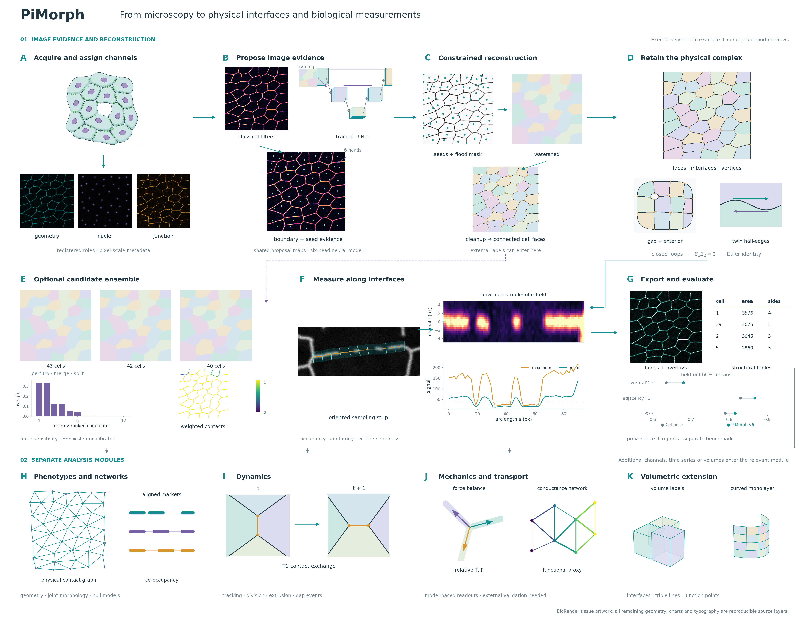

# PiMorph

**Reconstruct cell contacts, multicellular vertices, and junction organization from microscopy.**

PiMorph turns a labelled cell image into an embedded cell complex: cells and enclosed gaps are faces, connected interfaces are edges, and multicellular junctions are vertices. It also reconstructs these objects from fluorescence images using classical or learned proposals, samples molecular signals along interfaces, and measures uncertainty across alternative reconstructions.



*The complete PiMorph flow: image channels, classical or learned proposals, constrained reconstruction, the physical cell complex, optional candidate uncertainty, interface measurements and evaluation. Executed synthetic examples accompany conceptual views of the separate biological, temporal, mechanical, transport and 3-D modules. The [full figure caption and study](EXPLAINER.md#end-to-end-pimorph-flow) distinguish measured outputs from illustrations.*

**[Read the full study → EXPLAINER.md](EXPLAINER.md)** · **[Model cards](models/README.md)** · **[Archived results and checkpoints](https://doi.org/10.5281/zenodo.22839867)** · **[Editable SVGs and publication PDFs](docs/figures/)**

## Install

Python 3.12 is the recommended environment. The distribution is still named `endopigraph-ajmorph`; the current import and command are `pimorph`. The `endopigraph` command preserves the earlier graph pipeline.

```bash
git clone https://github.com/okezue/PiMorph.git
cd PiMorph
python3.12 -m venv .venv
source .venv/bin/activate
python -m pip install -e '.[dev,complex]'
```

For learned reconstruction and Cellpose-SAM comparisons, install `python -m pip install -e '.[torch]'`. PyTorch and Cellpose are optional for the classical pipeline and label-to-complex extraction. Cloud training dependencies are in `.[aws]`; operational instructions are in the [AWS runbook](docs/AWS_RUNBOOK.md).

## Run a complete example

This CPU example creates a small simulated endothelial sheet with separate membrane, nuclear, and junction channels. It requires no external images or checkpoint.

```bash
python examples/pimorph_demo.py
pimorph validate --labels output/demo_input/labels_truth.tif
pimorph reconstruct \
  --manifest output/demo_input/manifest.csv \
  --out output/demo_reconstruction
pimorph validate --labels output/demo_reconstruction/synthetic_demo/labels.tif
```

The first validation checks the known simulated labels. The second checks the reconstructed representation. A valid complex can still contain incorrect cells, contacts, or gaps: topological consistency is a separate question from agreement with ground truth.

Add `--posterior` to `reconstruct` to evaluate alternative legal reconstructions. `--moves` controls how many split and merge candidates are attempted; `--ess` sets the target effective sample size for the finite ensemble. Its intervals describe uncertainty within that candidate family, rather than a calibrated probability of biological correctness.

## Analyze your microscopy

Create a CSV with one row per field of view. Separate single-channel files make channel roles explicit; paths are relative to the manifest's directory.

```csv
image_id,path_geometry,path_nuclei,path_junction,geometry_source,pixel_size_um,condition,replicate
field_01,membrane.tif,dapi.tif,ve_cadherin.tif,membrane_channel,0.325,control,1
```

The `pixel_size_um` value above is an example; use your acquisition calibration. Verify the recorded scale against microscope metadata or a scale bar. TIFF print-resolution tags may not describe physical microscopy spacing, and a manifest value does not override every TIFF-derived scale in the current reader.

Use a membrane channel to locate boundaries when available, a nuclear channel for additional seed evidence, and a junction channel for interface measurements. If VE-cadherin supplies both geometry and junction signal, use the same path twice and set `geometry_source` to `junction_channel`. That coupling is recorded because measuring continuity on boundaries located from the same signal introduces selection bias. A nuclei file is optional. Multichannel TIFF manifests with `path` and `channel_1`, `channel_2`, … are also supported; inspect the inferred roles before a large run.

```bash
# Classical reconstruction; no trained weights needed.
pimorph reconstruct --manifest data/my_fields.csv --out output/my_fields --posterior

# Learned proposals, followed by the constrained decoder.
python scripts/fetch_zenodo.py --models
pimorph reconstruct \
  --manifest data/my_fields.csv \
  --checkpoint models/pimorph_proposals_v6_pool.pt \
  --out output/my_fields_neural
```

`v6_pool` is the current in-domain checkpoint for bright membrane/junction images of monolayers. Its reliability depends on tissue, confluence, image scale, and acquisition. Consult the [model cards](models/README.md) before applying it to a new domain. `--crop R0 R1 C0 C1`, `--max-items N`, `--ids ID ...`, and `--downsample N` support smaller trials; downsampling changes both the image and coordinate scale. The benchmark's tuned decoder settings and test-time augmentation are not automatically applied by `reconstruct`.

## Outputs

Each field gets a subdirectory; `run_report.csv` summarizes the run.

| File | Contents |
|---|---|
| `labels.tif` | Reconstructed integer cell labels; zero is background |
| `complex.json` | Full half-edge complex, incidence, and raw/smoothed geometry |
| `cells.csv` | Canonical cell-face geometry, areas, side counts, and identifiers |
| `interfaces.csv` | Individual connected interface components, face incidence, lengths, and interface type |
| `vertices.csv` | Vertex locations, degree, incident cells, and artificial-vertex flag |
| `gaps.csv` | Enclosed-background geometry and surrounding cells |
| `provenance.json` | Channel roles, calibration, proposer, coordinate scale, and extraction metadata |
| `edges.csv`, graph exports | Legacy-style cell-pair contact and AJ feature outputs |
| `posterior_summary.json`, `contact_probabilities.json`, `vertex_credible.json` | Additional outputs with `--posterior`: candidate weights/summary, contact existence weights, and conditional vertex spread |

Rows in `interfaces.csv` preserve disconnected contacts between the same two cells. A simple graph can merge those contacts and loses cyclic order and gap geometry. Vertex coordinates are stored as `(row, col)`; geometry is in pixels unless calibrated columns are available.

The current reconstruction CLI writes canonical `cells.csv` after the legacy adapter, replacing the legacy cell-table schema. Consumers requiring legacy columns should use `write_legacy_outputs` in a separate output directory. Legacy-style AJ feature names also do not guarantee identical numerical definitions between the two pipelines; the [explainer](EXPLAINER.md) distinguishes these measurements.

## Work from existing labels

```python
import tifffile
from pimorph.complex import extract_complex, validate
from pimorph.complex.geometry import smooth_complex
from pimorph.io import complex_tables, write_tables

labels = tifffile.imread('my_labels.tif')  # 2-D integers; background 0
complex_ = extract_complex(labels, pixel_size_um=0.325)  # use your true scale
assert validate(complex_).ok
smooth_complex(complex_)
write_tables(complex_tables(complex_, labels=labels), 'output/my_complex', fmt='csv')
```

The library also exposes strip-based junction profiles, cell tracking and event detection, relative force inference, 3-D complexes, and multichannel transport proxies. Their APIs and the scope of their validation are described in [EXPLAINER.md](EXPLAINER.md). Those capabilities are library modules and analysis scripts, not additional `pimorph` CLI subcommands. Two of them have now met real measurements: relative force inference recovers the tension excess of laser-ablated boundary cables in 15 of 15 fields and ranks recoil velocity with Spearman 0.64 (n = 15, tension-only setting); the structural part of the transport proxy was tested against 216 transepithelial resistance readings of maturing iPSC-RPE and failed (it has the wrong sign and is indistinguishable from cell density), so barrier reports keep `validated: false` and the junction-coverage term remains untested for lack of paired data.

## Benchmarks and tests

Generate labelled synthetic tiles and run the benchmark harness:

```bash
pimorph synth --n 8 --shape 192 --seed 17 --out output/synthetic_tiles
pimorph benchmark --dataset synth --root output/synthetic_tiles \
  --methods classical --out output/synthetic_benchmark
python -m pytest tests/ -q
```

Neural benchmarking uses `PIMORPH_NEURAL_CKPT`; the published settings additionally use dataset-specific decoder overrides, test-time augmentation, ROI handling, and explicit split lists. [Model cards](models/README.md) and [the final benchmark script](infra/xai/run_final_bench.sh) record that protocol. A fresh run with default settings is not a reproduction of the final tuned table.

The study reports image-level structural accuracy across several domains, and the comparison is symmetric: Cellpose-SAM was fine-tuned on exactly the fields that trained `v6_pool`. On five held-out hCEC fields `v6_pool` has mean vertex F1 **0.680**, adjacency F1 **0.867** and PQ **0.816**; zero-shot Cellpose-SAM gives **0.635 / 0.830 / 0.790** and Cellpose-SAM fine-tuned on the same ten training fields gives **0.695 / 0.937 / 0.862**. PiMorph's proposal model is therefore competitive with, not better than, a fine-tuned Cellpose-SAM; it keeps the higher vertex F1 on FlyWing and HAEC and the better vertex localization, and one checkpoint holds both confluent and sub-confluent cultures where each fine-tuned Cellpose-SAM collapses outside its own. The structural outputs (vertices with incident sets, gaps, contact multiplicity, validity, candidate uncertainty) apply to either segmenter's masks, and Cellpose is now a proposer inside PiMorph (`CellposeProposer`): its masks enter the constrained decoder, energy and posterior directly, at no loss of accuracy (hCEC 0.936 / 0.691 / 0.861 through PiMorph). See the [paired and symmetric results, split definitions, and limitations](EXPLAINER.md), rather than interpreting these numbers as universal accuracy.

## Legacy EndoPiGraph pipeline

The original command remains available for reproducibility:

```bash
endopigraph download --accession S-BIAD1540 --out data/raw --method print
endopigraph make-manifest --input data/raw/S-BIAD1540 --out data/manifest.csv
cp examples/config_sbiad1540.yaml config.yaml
# Obtain the listed images, then review paths, channels, calibration, and segmentation settings.
endopigraph run --config config.yaml
```

`--method print` prints download instructions; it does not download the images. The example configuration selects Cellpose, requiring the optional `cellpose`/`torch` dependencies. The legacy pipeline produces graph/QC reports and AJ morphology features. Its heuristic state names are feature-derived labels, not expert-validated junction classes. GMM clustering is available through `endopigraph.cluster_junctions_gmm` with the `ml` extra.

## Data and reproducibility

The audited release is **[Zenodo version 1.1.0, record 22839867](https://doi.org/10.5281/zenodo.22839867)**. The [concept DOI](https://doi.org/10.5281/zenodo.22839866) follows newer versions.

| Archive | Download size | Contents |
|---|---:|---|
| `pimorph_results.tar` | 996.5 MB | Per-field metrics, summary tables, shear ensembles, QC images, dynamics/mechanics/multichannel outputs, and historical documents |
| `pimorph_models.tar` | 536.4 MB | Proposal checkpoints, cards, training configurations, and logs |
| `pimorph_training_tiles.tar` | 1,583.9 MB | Synthetic validation tiles and released real-image pseudo-label tiles |

`python scripts/fetch_zenodo.py --only pimorph_results.tar` downloads and verifies the results archive. The helper resolves the concept record, so record the version and checksum it prints. Extraction preserves the current root, `docs/`, and `models/` Markdown by default while retaining run-specific reports. Use `--include-archived-docs` only for an intentional historical restore:

```bash
python scripts/fetch_zenodo.py --only pimorph_results.tar --extract
```

Third-party images and annotation sources have their own terms; source links, preparation steps, and evaluation units are catalogued in [EXPLAINER.md](EXPLAINER.md). Git LFS pointers are not image pixels. The figure scripts use compact committed source tables plus the identified image panels; figure provenance and editable sources are linked in the explainer.

## Repository guide

| Path | Purpose |
|---|---|
| `src/pimorph/` | Cell complexes, inference, fields, metrics, dynamics, mechanics, 3-D, and function modules |
| `src/endopigraph/` | Original graph and AJ morphology pipeline |
| `tests/` | Existing unit, property, integration, and optional data/torch tests |
| `scripts/`, `examples/` | Analysis, data preparation, figure generation, and runnable examples |
| `docs/figures/`, `docs/figure_data/` | Publication figures and their compact source data/provenance |
| `runs/` | Historical and current machine-readable results; generated reports retain their run context |
| `models/README.md` | Consolidated checkpoint cards and training lineage |
| `infra/` | Training and infrastructure scripts |

## Citation and terms

Please credit **Okezue Bell** (okezue@stanford.edu) and **Anthony Bell**, cite the specific [Zenodo release](https://doi.org/10.5281/zenodo.22839867), and cite the original datasets used in your analysis. [CITATION.cff](CITATION.cff) provides citation metadata for the earlier software v1.0.0 release ([Zenodo 19831621](https://doi.org/10.5281/zenodo.19831621)); it is distinct from the v1.1.0 data archive and the current development code. Code is under the [MIT license](LICENSE); dataset, checkpoint-source, and BioRender artwork terms are separate. The [study explainer](EXPLAINER.md) records attribution and evidence limitations.
